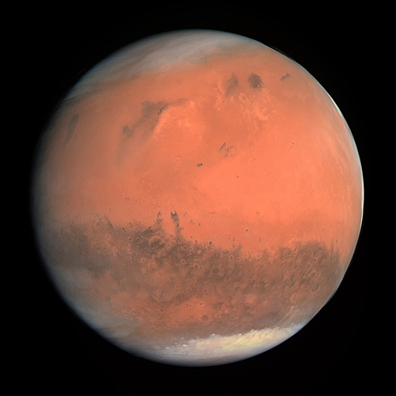
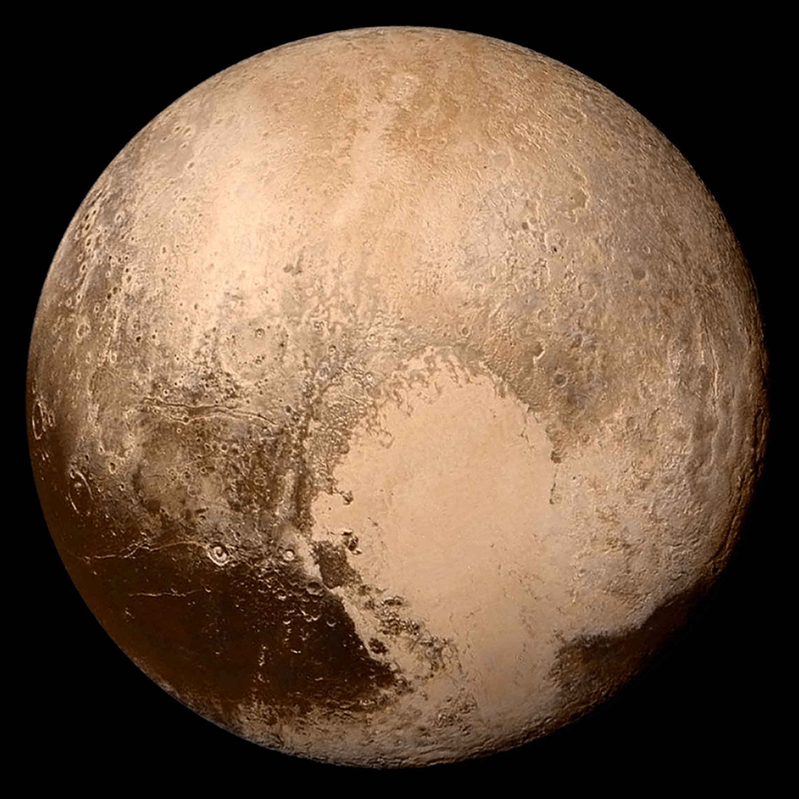

## 🌐 العرض الحي للمشروع

لمشاهدة النموذج التفاعلي للنظام الشمسي، يمكنك زيارة الرابط التالي:

🔗 [اضغط هنا لعرض المشروع](https://alostoura-official.github.io/Solar-System/)
## 🪐 صور الكواكب

<table align="center">
  <tr>
    <td align="center">
       عطارد
    </td>
    <td align="center">
       الزهرة
    </td>
    <td align="center">
       الأرض
    </td>
    <td align="center">
       المريخ
    </td>
    <td align="center">
       المشتري
    </td>
    <td align="center">
       زحل
    </td>
    <td align="center">
       أورانوس
    </td>
    <td align="center">
       نبتون
    </td>
    <td align="center">
       بلوتو
    </td>
  </tr>
</table>

# النظام الشمسي: نظرة شاملة
النظام الشمسي – ويُعرف أيضاً بالمجموعة الشمسية أو المنظومة الشمسية – هو نظام كوكبي يتكوّن من الشمس، وكل ما يدور حولها من أجرام سماوية، بما في ذلك الأرض وبقية الكواكب. بالإضافة إلى الكواكب الرئيسية، يضم النظام الشمسي أجراماً أصغر حجماً، مثل الكواكب القزمة، والكويكبات، والنيازك، والمذنبات، إلى جانب سحابة رقيقة من الغاز والغبار تُعرف باسم الوسط بين الكوكبي.

لا تدور جميع الأجرام حول الشمس مباشرة؛ فهناك أقمار طبيعية، تُعرف اختصارًا بـ "الأقمار"، تدور حول الكواكب وتُعد توابع لها. ويُقدّر عدد هذه الأقمار المعروفة في النظام الشمسي بأكثر من 150 قمرًا، يتمركز معظمها حول الكواكب الغازية العملاقة، ويزيد حجم اثنين منها عن حجم كوكب عطارد.

تُعد الشمس الجرم المركزي الأكبر والأكثر أهمية في النظام الشمسي، إذ تُمثّل وحدها ما يقارب 99.9% من الكتلة الكلية للنظام. أما الكتلة المتبقية فتستحوذ الكواكب، وعلى رأسها كوكب المشتري، على الجزء الأكبر منها. الشمس هي المصدر الرئيسي للضوء والحرارة، ما يجعل الحياة على الأرض ممكنة، ورغم ذلك فهي نجم متوسط الحجم مقارنة بالنجوم الأخرى في الكون.

يتألف النظام الشمسي من ثمانية كواكب رئيسية، تُرتّب حسب بعدها عن الشمس كما يلي:

الكواكب الصخرية: عطارد، الزهرة، الأرض، المريخ.

الكواكب الغازية العملاقة: المشتري، زحل، أورانوس، نبتون.

يتكون كل من المشتري وزحل بشكل أساسي من الهيدروجين والهيليوم، بينما يتكوّن أورانوس ونبتون – وهما الأبعد عن الشمس – من مركّبات ذات درجات انصهار أعلى نسبيًا، مثل الماء والأمونيا والميثان، ما يجعل تصنيفهما أحيانًا "عمالقة جليدية". تدور جميع هذه الكواكب في مدارات شبه دائرية ضمن مستوى مسطّح يُعرف بـ مستوى مسار النظام الشمسي.

يمكن رؤية عدد من أجرام النظام الشمسي بالعين المجردة، مثل الشمس والقمر، والكواكب عطارد، الزهرة، المريخ، المشتري، وزحل، إلى جانب بعض الكويكبات والمذنبات اللامعة العابرة، وكذلك الشهب التي تنتج عن احتراق النيازك عند دخولها الغلاف الجوي للأرض. أما باستخدام المقراب (التلسكوب)، فيمكن رؤية أجرامٍ أكثر بكثير وبصورة أوضح.

تشير الأبحاث الفلكية الحديثة إلى أن النظام الشمسي تشكّل قبل نحو 4.6 مليارات سنة من سديم شمسي – وهو سحابة ضخمة من الغاز والغبار. ووفقًا للنظرية السائدة، انهارت هذه السحابة تحت تأثير جاذبيتها، فتجمعت معظم مادتها في مركزها مكوّنة الشمس، بينما بدأت الجسيمات المتبقية بالتراكم والتصادم لتشكّل أجسامًا أكبر، تطورت لاحقًا إلى الكواكب، وما تبقى منها كوّن الأقمار والكويكبات والمذنبات.
